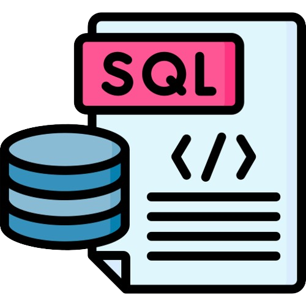

## SQLChallenge

 

Welcome to SQLChallenge, a project dedicated to solving problems with MySQL 8.0. This repository has been created to share solutions and tips for overcoming various MySQL-related challenges.

This project is based on the following:  [SQL Project](https://techtfq.com/blog/sql-project-sql-case-study-to-solve-and-practice-sql-queries#google_vignette)

### Objective

The main objective of this project is to train myself on various SQL queries by proposing clear and comprehensible solutions to the various questions.

### Repository structure

The repository is organized as follows: 
  - `/data` is the directory where you put your csv files.
  - `/configuration` is the directory where you need to store variables to connect to the database.
  - `csv_to_databse.py` contains code to integrate data from csv files into your database.
  - `SQLSolutions.py` contains my SQL queries to answer the various questions.
  
All the csv files are available on: [Famous Paintings Dataset](https://www.kaggle.com/datasets/mexwell/famous-paintings)

### MySQL version

The solutions presented in this repository are based on MySQL 8.0. Be sure to use the appropriate version for best results.
